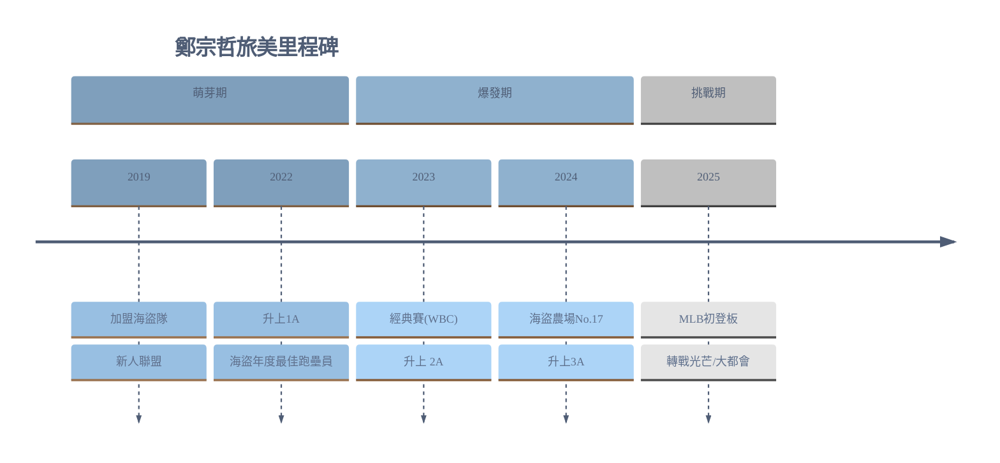

--------------------------------------------------------------------------
鄭宗哲[^2]    [@zero_cheng_12](https://www.instagram.com/zero_cheng_12/)
![[z_photo.png|200]]
▲ Photo: MLB Taiwan 美國職棒大聯盟[^3]

在逆境中穩定輸出、以小搏大，且能讓觀看者感受到希望的特質。我選擇的 MVP，並非身形魁梧的重砲手，而是在[[第五屆世界棒球經典賽]]（WBC），以靈活身手和超齡沈穩驚艷全台，也是目前正以台灣唯一旅美野手身分在大聯盟體系奮鬥的—鄭宗哲。

> **特殊里程碑**： 
> - **2023 WBC**：中華隊開路先鋒，打擊率 .333 
> - **2025 MLB Debut**：4月9日代表匹茲堡海盜隊初登板 

> **球探報告亮點**[^4] (大聯盟平均實力為50分)： 
> - 🏃 **速度 (Run)**：60
> - 🛡️ **守備 (Field)**：65 
> - **💪🏼 臂力 (Arm)**  :  50
> - 🧠 **優勢**：極佳的本壘板紀律與戰術執行能力

--------------------------------------------------------------------------
## 一、 初識：經典賽場上的奇兵

我開始關注鄭宗哲的契機，是在2023年第五屆世界棒球經典賽。當時的中華隊陣容換血，許多球迷對於這批年輕選手能否扛住高張力的國際賽充滿疑慮。而當時正是這位年僅 21 歲、擔任開路先鋒的球員，徹底打破了我的刻板印象。

在讓全台灣人屏氣凝神的系列賽中，最讓我印象深刻的並非某一支特大號全壘打，而是他在高壓環境下展現出的穩定性。面對各國強投的速球與刁鑽變化球，鄭宗哲展現極佳的選球紀律與纏鬥能力。不急躁，能精準的執行戰術，將球擊到對手防守的空擋，或靠著腳程壓迫對手防線。

特別是對戰義大利的那場關鍵戰役，他在關鍵時刻點出的那一記觸擊[^1]，至今仍深深印在我的腦海裡。不僅是戰術執行的成功，更展現一種不怯場的心理素質。成為了當時中華隊最安定的力量。那一刻，我意識到這位球員擁有的，是比技術更珍貴的心理韌性。

## 二、 旅美之路：靈活身手與身材劣勢的博弈

經典賽結束後，我開始深入研究他的旅美生涯。這才發現，鄭宗哲的棒球路並非一帆風順。在講究身材條件、充斥著怪力男的美國職棒體系中，身高僅 172 公分的鄭宗哲，無疑是處於絕對劣勢的。在球探報告中，他可能永遠不會是那個擁有最高天花板的球員，但他卻用極致的努力，將自己的地板墊高。

他的靈活身手在美式強力棒球的夾縫中顯得格外珍貴。他的守備範圍廣闊，移動速度極快，無論是游擊的快速橫移，還是二壘防區的雙殺策動，都展現了行雲流水的協調。在打擊方面，他深知自己的優勢不在於盲目追求長打，而是將球跟進來、擊強，並利用速度撕裂對手的防線。

## 三、 精神象徵：孤獨而堅定的挑戰者

目前，鄭宗哲是台灣在大聯盟體系40人名單中唯一的野手。看著他從新人聯盟層級一步步爬升，從 1A、2A 到 3A，再到被放入 [[40 人名單]]，這每一個里程碑都是他用汗水換來的。他在美國拼戰的精神，對我有著巨大的鼓舞作用。即使最近連續遭海盜DFA到光芒再至大都會隊，也期望他能不受影響，在剩餘一個多月的第六屆國際棒球經典賽中打出亮眼表現。

## 四、2025 MLB Percentile Rankings  [^5]

| Season | Age | Pitches | Battled Balls | Barrels | Barrel% | Barrel/PA | Exit Velocity | Max EV | Launch Angle | LA Sweet- Spot % | XBA  | XSLG | WOBA | XWOBA | XWOBACON | HardHit% | K%   | BB% |
| ------ | --- | ------- | ------------- | ------- | ------- | --------- | ------------- | ------ | ------------ | ---------------- | ---- | ---- | ---- | ----- | -------- | -------- | ---- | --- |
| Player |     | 24      | 4             | 0       | 0.0     | 0.0       | 93.2          | 100.6  | 17.9         | 25.0             | .167 | .218 | .000 | .165  | .288     | 50.0     | 42.9 | 0.0 |
| MLB    |     |         |               |         | 7.2     | 4.9       | 88.6          | 122.9  | 12.4         | 33.3             | .243 | .408 | .315 | .316  | .369     | 37.0     | 22.2 | 8.4 |
![[statcast.png]]
#### MLB首秀
<iframe width="100%" height="400" src="https://www.youtube.com/embed/z8eEiffQjM8?start=0" frameborder="0" allow="accelerometer; autoplay; clipboard-write; encrypted-media; gyroscope; picture-in-picture" allowfullscreen></iframe> 
<small style="color: grey; display: block; text-align: center;"</small>

## 五、圖文漫畫
![[1.png]]
![[2.png]]
![[3.png]]
![[4.png]]
![[5.png]]

[^1]: https://youtu.be/wsDS1bEbpa8?si=HWy8RWYPY2fIWx5w

[^2]: https://twbsball.dils.tku.edu.tw/wiki/index.php?title=%E9%84%AD%E5%AE%97%E5%93%B2(2001)

[^3]: https://www.facebook.com/TAIWAN.MLB/?locale=zh_TW

[^4]: https://www.mlb.com/milb/prospects/pirates/

[^5]: https://baseballsavant.mlb.com/savant-player/tsung-che-cheng-691907?stats=statcast-r-hitting-mlb

